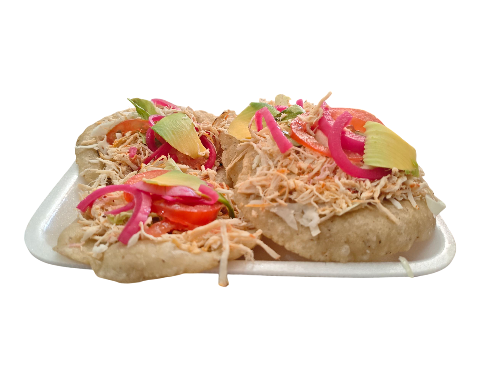
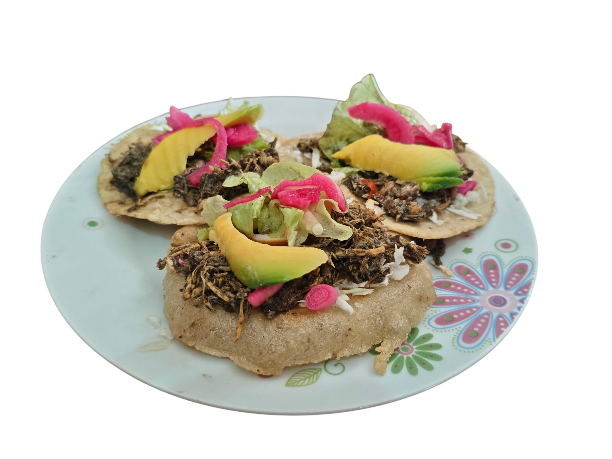
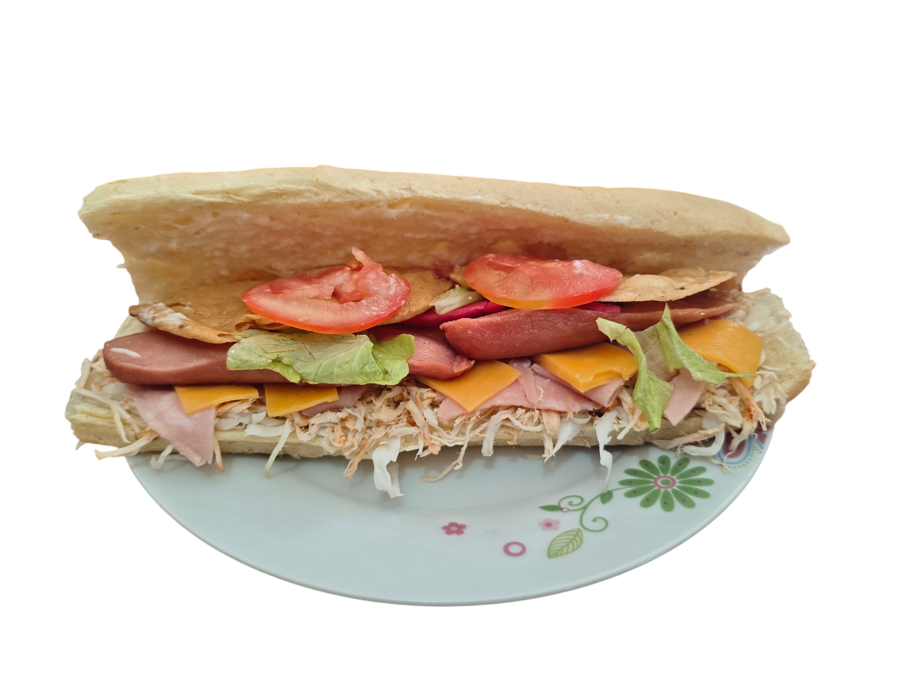
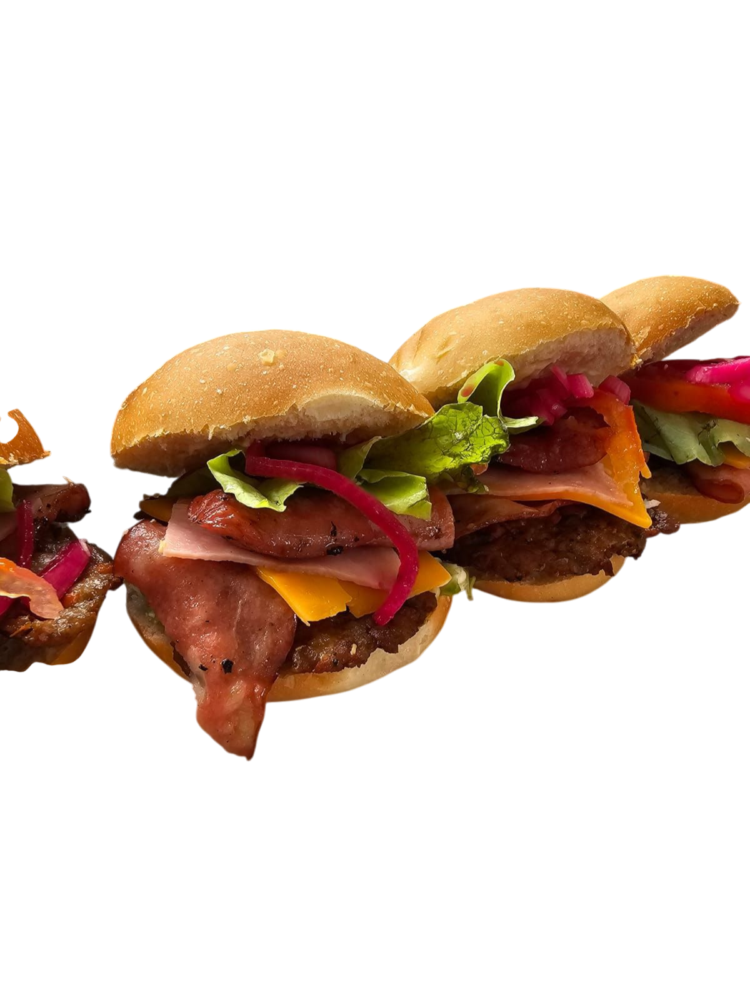
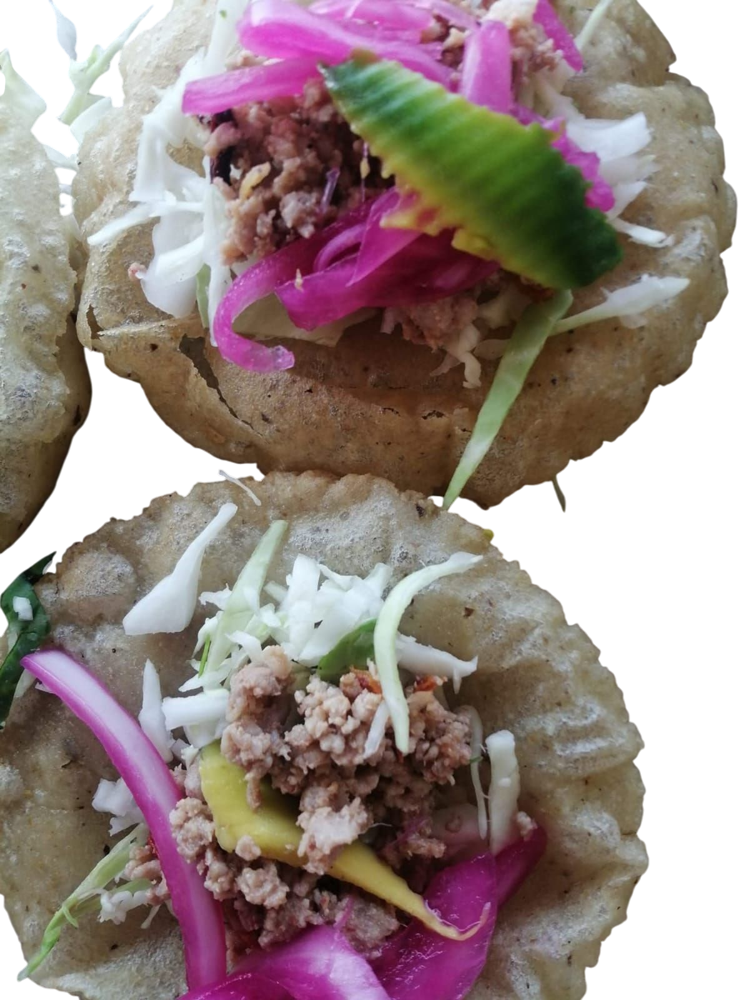
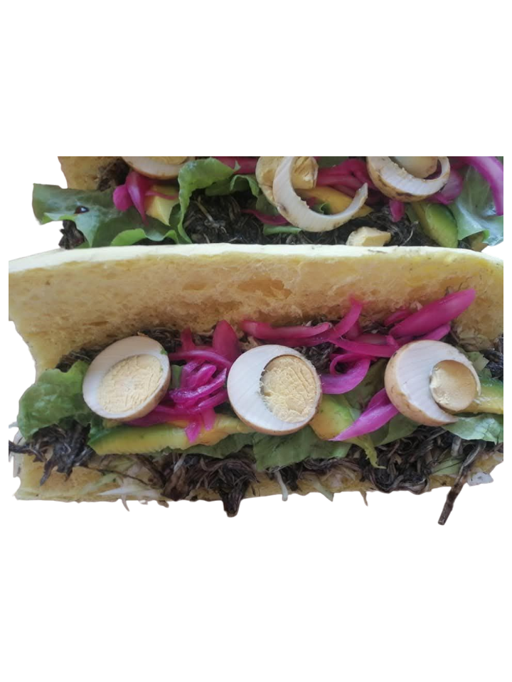

<!DOCTYPE html>
<html lang="es">
<head>
    <meta charset="UTF-8">
    <meta name="viewport" content="width=device-width, initial-scale=1.0">
    <title>Menú de Antojitos</title>
    <!-- Carga de Tailwind CSS -->
    
    
</head>
<body class="min-h-screen p-4 sm:p-8">

    <!-- Encabezado del Menú -->
    <header class="text-center mb-10 mt-4">
        <h1 class="text-4xl sm:text-5xl font-extrabold text-[#D97706] drop-shadow-lg">
            Nuestro Menú
        </h1>
        

            ¡Sabores Tradicionales y Antojitos Únicos!
        

    </header>

    <!-- Contenedor de la Rejilla del Menú -->
    <main class="max-w-6xl mx-auto">
        

            
            <!-- TARJETA DE PRODUCTO: Trancas de Relleno -->
            

                <!-- Espacio para la Foto -->
                
                
                 
                    <h2 class="text-2xl font-bold text-[#D97706] mb-2 text-center" >PANUCHOS DE POLLO</h2>
                    
                
            

            <!-- TARJETA DE PRODUCTO: Panuchos de Relleno -->
            

                <!-- Espacio para la Foto -->
                
                 
                    <h2 class="text-2xl font-bold text-[#D97706] mb-2 text-center">PANUCHOS DE RELLENO</h2>
                   
                
            

            <!-- TARJETA DE PRODUCTO: Tranca de Pollo -->
            

                <!-- Espacio para la Foto -->
               
                
                
                    <h2 class="text-2xl font-bold text-[#D97706] mb-2 text-center">TRANCA DE POLLO</h2>
                    
            

            <!-- TARJETA DE PRODUCTO: Panuchos de Pollo -->
            

                <!-- Espacio para la Foto -->
                
                 
                
                
                    <h2 class="text-2xl font-bold text-[#D97706] mb-2 text-center">HAMBURGUESITAS</h2>
                    
            

            <!-- TARJETA DE PRODUCTO: Panuchos de Carne Molida -->
            

                <!-- Espacio para la Foto -->
               
                
                
                
                    <h2 class="text-2xl font-bold text-[#D97706] mb-2 text-center">PANUCHOS DE CARNE MOLIDA </h2>
                   
            

            <!-- TARJETA DE PRODUCTO: Hamburguesitas -->
            

                <!-- Espacio para la Foto -->
                
                
               
                    <h2 class="text-2xl font-bold text-[#D97706] mb-2 text-center">TRANCAS DE RELLENO</h2>
                    
            

            <!-- TARJETA DE PRODUCTO: Empanadas de Queso y Mixtas -->
            

                <!-- Espacio para la Foto -->
                

                    <!-- Puedes reemplazar este div por tu etiqueta  -->
                

                
                

                    <h2 class="text-2xl font-bold text-[#D97706] mb-2">Empanadas (Queso y Mixtas)</h2>
                    
Elige entre queso derretido o la opción mixta con queso y algún guiso especial.

                    
                

            

        

    </main>
    
    <!-- Pie de página simple -->
    <footer class="text-center mt-10 p-4 text-gray-600">
        
&copy; 2025 Menú de Antojitos. ¡Gracias por tu preferencia!

    </footer>

</body>
</html>
